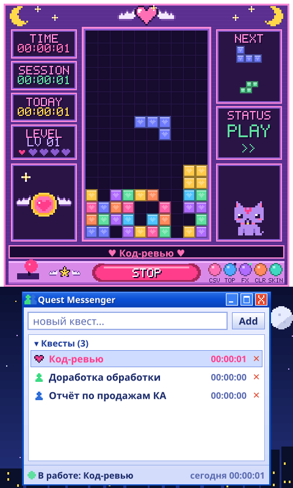
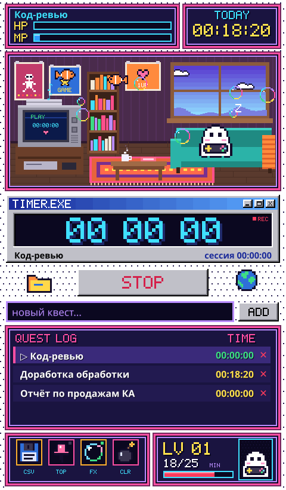
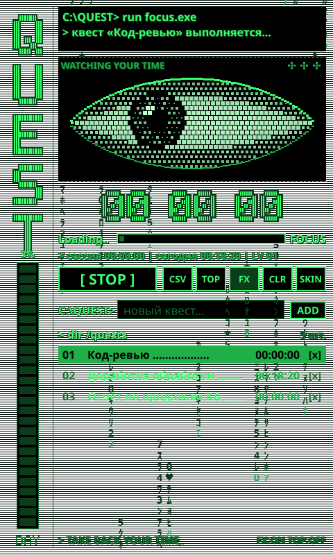

<p align="center">
  
</p>

<h1 align="center">★ Task Quest ★</h1>

<p align="center">Ретро-трекер времени для задач на macOS с переключаемыми скинами.<br>
Нажимаешь «СТАРТ», работаешь, а пиксельные друзья тебя подбадривают.</p>

<p align="center">
  
  
  
</p>

## Возможности

- **Старт / стоп** одной кнопкой или **пробелом**
- **Список задач («квестов»)**: добавить, выбрать, удалить, очистить весь список (с резервной копией). Клик по другой задаче во время работы переключает таймер на неё
- **Время по каждой задаче** и **общее время за день**
- **Уровни**: каждые 25 минут работы за день дают новый LV и «LEVEL UP!»
- **Экспорт в CSV** (открывается в Excel) со всеми сессиями и итогами
- **Режим «поверх окон»**
- **Три скина**: **Moon** (по умолчанию), **2000** и **Terminal**. Переключаются по кругу кнопкой **SKIN** на лету. Таймер, квесты и история при этом сохраняются, а выбранный скин запоминается
- Если закрыть окно при идущем таймере, время продолжит считаться до следующего запуска
- Данные сразу сохраняются в `tracker_data.json` рядом со скриптом

## Скины

### ☾ Moon — скин по умолчанию

Волшебный аркадный автомат и мессенджер в духе Windows XP под ночным небом.

- **Стакан с блоками-сердечками**: пока идёт таймер, фигуры сами падают, складываются и собирают линии. На паузе в стакане сияет большое сердце с лучами и мигает «PRESS START»
- **Колонки автомата**: TIME (время квеста), SESSION (текущая сессия), TODAY (за день), LEVEL с пятью сердечками опыта, NEXT со следующими фигурами и STATUS (PLAY / PAUSE)
- **Герои**: крылатая пудреница с сердцем и сиреневая кошечка с сердечком на лбу, которая спит на паузе
- **Пульт**: джойстик качается во время работы, большая кнопка START/STOP и круглые кнопки CSV, TOP, FX, CLR, SKIN
- **Quest Messenger**: список квестов как список контактов. У квеста в работе пульсирует сердечко, у выбранного горит звёздочка, а в строке статуса видно «В работе» или «Пауза» и время за день

### ✦ 2000

Неоновый RPG-интерфейс, окошки в духе Windows 98 и уютная ретро-комната.

- **Комната**: призрак на диване играет в приставку, пока идёт таймер, и спит, когда таймер стоит. На ЭЛТ-телевизоре при работе идёт время сессии, без неё — помехи и «NO SIGNAL». В окне плывут облака, над кружкой поднимается пар
- **HP** — прогресс текущей сессии к 25-минутному фокус-блоку, **MP** — прогресс дня к цели в 8 часов, **TODAY** — общее время за день
- **TIMER.EXE** — главный таймер выбранного квеста, во время работы мигает **REC**
- **Инвентарь**: 💾 CSV, 📌 поверх окон, 🫧 пузыри и рыбки-клоуны (FX), 💣 очистить список, 🎨 сменить скин
- **LV-панель** с портретом призрака: уровень и минуты до следующего
- После 10 минут простоя всплывает окошко **«HELLO!! ARE YOU HERE??»** с кнопкой «MAYBE...»

### ▚ Terminal

Зелёный фосфорный экран старого терминала.

- **Командная строка** печатает вопрос «Войти в квест «…»? Y/N ..» с мигающим курсором, а во время работы — «квест выполняется...»
- **Полутоновый глаз** следит за временем: пока идёт таймер, он открыт, моргает и водит зрачком, а на паузе дремлет и иногда приоткрывается
- **Большой таймер** из вертикальных штрихов со свечением, полоса **Loading.. FOCUS** — прогресс 25-минутной сессии, слева вертикальная надпись QUEST и шкала дня
- **Список квестов** в виде вывода `dir`: выбранный выделен инверсией, у квеста в работе мигает ▶
- **Падающие символы** на фоне (кнопка FX), кнопки-команды `[ START ]`, `CSV`, `TOP`, `CLR`, `SKIN`

🥚 **Пасхалки**: попробуй кликнуть по кошечке в Moon, по призраку в 2000 и по глазу в Terminal.

Все персонажи и спрайты оригинальные и нарисованы прямо в коде строками пикселей.

## Запуск

Нужен только Python 3 с tkinter, сторонние библиотеки не требуются.

```bash
python3 task_quest.py
```

Можно и двойным кликом по `Запустить Task Quest.command`. Чтобы сразу открыть нужный скин, добавь `moon`, `2000` или `term` к команде: `python3 task_quest.py 2000`.

### Приложение для macOS с иконкой

```bash
python3 build_app.py
```

Рядом появится `Task Quest.app`. Его можно перетащить в «Программы» или в Dock. Приложение запускает `task_quest.py` из этой папки, поэтому после переноса папки его нужно пересобрать.

## Управление

| Действие | Как |
|---|---|
| Старт / стоп | кнопка или `Пробел` |
| Добавить задачу | ввести название и нажать `Enter`, `Add` или `ADD` |
| Выбрать задачу | клик по строке |
| Удалить задачу | `✕` |
| Сменить скин | `SKIN` |
| Прокрутка списка | колесо мыши |

## Файлы

| Файл | Что внутри |
|---|---|
| `task_quest.py` | приложение: окно, переключение скинов, иконка-секундомер |
| `pixel_tracker.py` | ядро: данные, таймер, общие действия |
| `task_quest_2000.py` | скин 2000 |
| `task_quest_moon.py` | скин Moon |
| `task_quest_terminal.py` | скин Terminal |
| `build_app.py` | сборка `Task Quest.app` |
