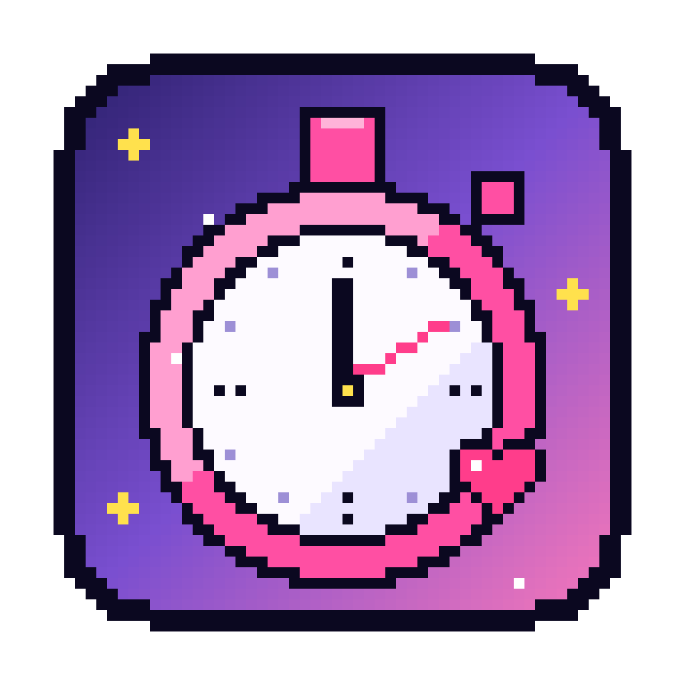
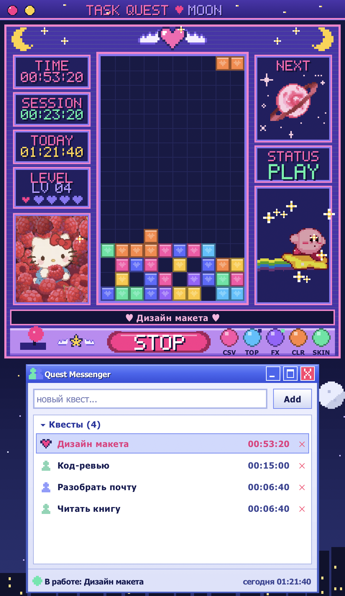
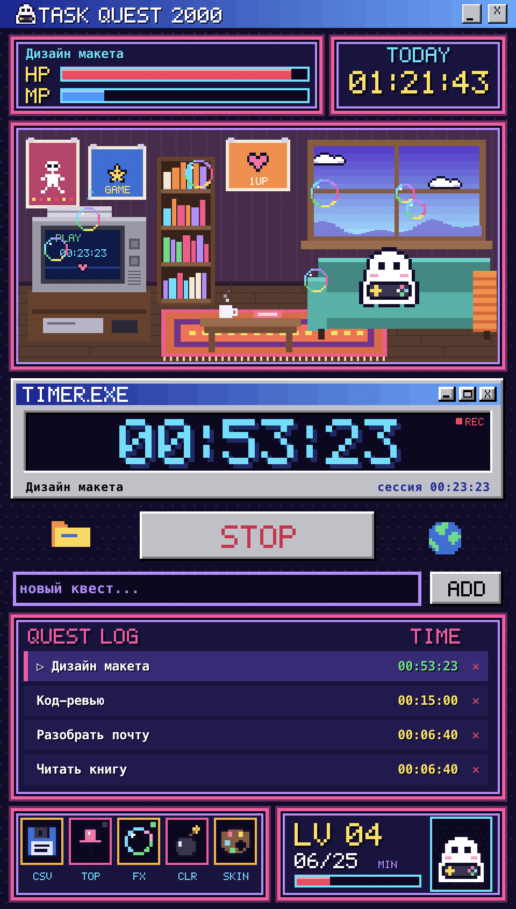
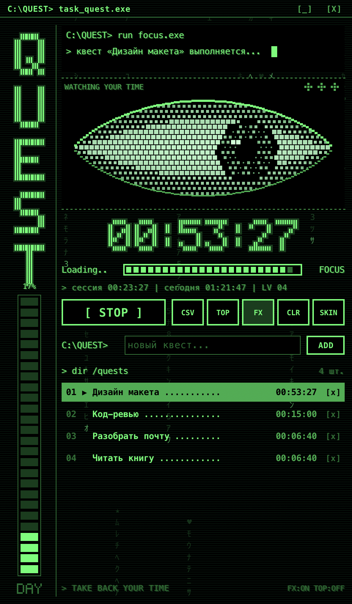
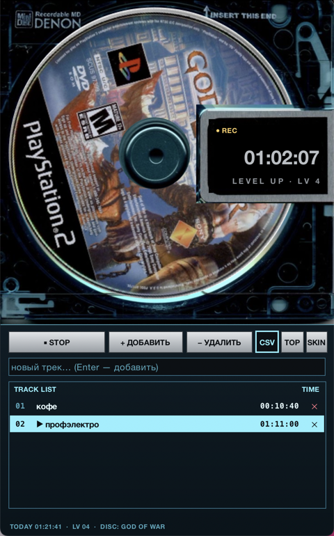

<p align="center">
  
</p>

<h1 align="center">★ Task Quest ★</h1>

<p align="center">Ретро-трекер времени для задач на macOS с переключаемыми скинами.<br>
Нажимаешь «СТАРТ», работаешь, а пиксельные друзья тебя подбадривают.</p>

<p align="center">
  
  
  
  
</p>

## Возможности

- **Старт / стоп** одной кнопкой или **пробелом**
- **Список задач («квестов»)**: добавить, выбрать, удалить. Кнопка «Очистить» (CLR) сбрасывает время у всех квестов, а сами квесты остаются в списке (перед сбросом сохраняется резервная копия). Клик по другой задаче во время работы переключает таймер на неё
- **Время по каждой задаче** и **общее время за день**
- **Уровни**: каждые 25 минут работы за день дают новый LV и «LEVEL UP!»
- **Экспорт в CSV** (открывается в Excel) со всеми сессиями и итогами
- **Режим «поверх окон»**
- **Четыре скина**: **Moon** (по умолчанию), **2000**, **Terminal** и **MiniDisc**. Кнопка **SKIN** мгновенно открывает поверх окна список скинов со своим баром в стиле текущего скина и мини-иконками — выбирай мышкой или стрелками и Enter, Esc или клик мимо закрывают список. Таймер, квесты и история при этом сохраняются, а выбранный скин запоминается
- **Своя панель заголовка** в стиле каждого скина вместо стандартной: розовые кнопки-«конфеты» в Moon, заголовок Windows 98 в 2000, строка `C:\QUEST>` с кнопками `[_] [X]` в Terminal, брашированный металл в MiniDisc. Окно перетаскивается за панель, «свернуть» прячет приложение — вернуть его можно кликом по иконке в Dock
- Если закрыть окно при идущем таймере, время продолжит считаться до следующего запуска
- Данные сразу сохраняются в `tracker_data.json` рядом со скриптом

## Скины

### ☾ Moon — скин по умолчанию

Волшебный аркадный автомат и мессенджер в духе Windows XP под ночным небом.

- **Стакан с блоками-сердечками**: пока идёт таймер, фигуры сами падают, складываются и собирают линии. На паузе в стакане стоит автомат Kirby Crane Fever: клешня опускается за игрушкой и поднимается, звёздочки мерцают, мигает «PRESS START». По клику из автомата всплывают звёздочки — точные копии тех, что лежат рядом с ним
- **Колонки автомата**: TIME (время квеста), SESSION (текущая сессия), TODAY (за день), LEVEL с пятью сердечками опыта, NEXT с розовой планетой (кольцо вращается, звёзды вокруг мерцают) и STATUS (PLAY / PAUSE)
- **Герои**:
  - Кирби мчится на звезде в правой панели: радужный хвост струится назад, мимо летят искры, по клику подпрыгивает, и вверх всплывают звёздочки, как его звезда
  - Hello Kitty с малиной в левой панели (фон и листья вырезаны) — моргает, по клику летят сердечки
  - Синнаморол летает петлями по нижней части экрана туда и обратно: края картинки растворяются в мыльных пузырях, которые кружат и улетают, а по клику он выпускает облако пузырей
  - Сейлор Мун появляется в стакане на фоне луны, когда сессия завершена или получен новый уровень
- **Пульт**: джойстик качается во время работы, большая кнопка START/STOP и круглые кнопки CSV, TOP, FX, CLR (сброс времени), SKIN
- **Quest Messenger**: список квестов как список контактов. У квеста в работе пульсирует сердечко, у выбранного горит звёздочка, а в строке статуса видно «В работе» или «Пауза» и время за день

### ✦ 2000

Неоновый RPG-интерфейс, окошки в духе Windows 98 и уютная ретро-комната.

- **Комната**: призрак на диване играет в приставку, пока идёт таймер, и спит, когда таймер стоит. На ЭЛТ-телевизоре при работе идёт время сессии, без неё — помехи и «NO SIGNAL». В окне плывут облака, над кружкой поднимается пар
- **HP** — прогресс текущей сессии к 25-минутному фокус-блоку, **MP** — прогресс дня к цели в 8 часов, **TODAY** — общее время за день
- **TIMER.EXE** — главный таймер выбранного квеста, во время работы мигает **REC**
- **Инвентарь**: 💾 CSV, 📌 поверх окон, 🫧 пузыри и рыбки-клоуны (FX), 💣 сбросить время у всех квестов, 🎨 сменить скин
- **LV-панель** с портретом призрака: уровень и минуты до следующего
- После 10 минут простоя всплывает окошко **«HELLO!! ARE YOU HERE??»** с кнопкой «MAYBE...»

### ▚ Terminal

Зелёный фосфорный экран старого терминала.

- **Командная строка** печатает вопрос «Войти в квест «…»? Y/N ..» с мигающим курсором, а во время работы — «квест выполняется...»
- **Полутоновый глаз** следит за временем: пока идёт таймер, он открыт, моргает и водит зрачком, а на паузе дремлет и иногда приоткрывается
- **Большой таймер** из вертикальных штрихов со свечением, полоса **Loading.. FOCUS** — прогресс 25-минутной сессии, слева вертикальная надпись QUEST и шкала дня
- **Список квестов** в виде вывода `dir`: выбранный выделен инверсией, у квеста в работе мигает ▶
- **Падающие символы** на фоне (кнопка FX), кнопки-команды `[ START ]`, `CSV`, `TOP`, `CLR` (сброс времени), `SKIN`

### ◉ MiniDisc

Картридж MiniDisc, а внутри вместо родного диска — диски из нашей коллекции: Kirby Air Ride, God of War, Silent Hill 2, Resident Evil 4, Devil May Cry, Nirvana и другие, всего 18.

- **Диск крутится**, пока идёт таймер, — плавно, 60 кадров в секунду: вращение отдано macOS (Core Animation), поэтому оно не зависит от остального интерфейса и почти не грузит процессор. При старте диск разгоняется, а после стопа долго и плавно останавливается, как в старых CD-проигрывателях. Во время работы диски сами сменяются каждые 20 секунд. Клик по диску — «скретч» назад и следующий диск, каждый новый СТАРТ тоже ставит следующий
- **Окошко ярлыка на шторке**: REC / PAUSE, большое время квеста и название трека вразрядку
- **Серебристые кнопки** в цвет металлического ярлыка, при наведении подсвечиваются как в старых меню
- **TRACK LIST**: квесты как трек-лист с номерами, выбранный подсвечен голубой полосой
- Если Core Animation недоступна, диск крутится запасным способом — кадрами, которые рисуются в фоне через CoreGraphics (в `~/Library/Caches/TaskQuest/md` хранятся только текущий и следующий диск)

🥚 **Пасхалки**: попробуй кликнуть по Кирби, Hello Kitty и Синнамоли в Moon, по призраку в 2000 и по глазу в Terminal. В MiniDisc каждый второй клик по диску включает случайный трек из `assets/tracks` — название трека появится в окошке ярлыка. Свои mp3 можно добавить туда же или в папку программы.

Все персонажи, кроме фан-арта по присланным картинкам (Кирби, автомат Kirby Crane Fever, Hello Kitty, Синнаморол, Сейлор Мун), оригинальные и нарисованы прямо в коде строками пикселей.

## Запуск

Нужен только Python 3 с tkinter, сторонние библиотеки не требуются.

```bash
python3 task_quest.py
```

Можно и двойным кликом по `Запустить Task Quest.command`. Чтобы сразу открыть нужный скин, добавь `moon`, `2000`, `term` или `md` к команде: `python3 task_quest.py 2000`.

### Приложение для macOS с иконкой

```bash
python3 build_app.py
```

Рядом появится `Task Quest.app`. Его можно перетащить в «Программы» или в Dock. Приложение запускает `task_quest.py` из этой папки, поэтому после переноса папки его нужно пересобрать.

## Управление

| Действие | Как |
|---|---|
| Старт / стоп | кнопка или `Пробел` |
| Добавить задачу | ввести название и нажать `Enter`, `Add` или `ADD` |
| Выбрать задачу | клик по строке |
| Удалить задачу | `✕` |
| Сменить скин | `SKIN` → выбрать в списке |
| Прокрутка списка | колесо мыши |

## Файлы

| Файл | Что внутри |
|---|---|
| `task_quest.py` | приложение: окно, переключение скинов, иконка-секундомер |
| `pixel_tracker.py` | ядро: данные, таймер, общие действия |
| `task_quest_2000.py` | скин 2000 |
| `task_quest_moon.py` | скин Moon |
| `task_quest_terminal.py` | скин Terminal |
| `task_quest_md.py` | скин MiniDisc |
| `titlebar.py` | своя панель заголовка окна для каждого скина |
| `mac_disc.py` | вращение диска MiniDisc силами macOS (Core Animation) |
| `disc_render.py` | кадры вращения дисков (CoreGraphics) |
| `build_app.py` | сборка `Task Quest.app` |
