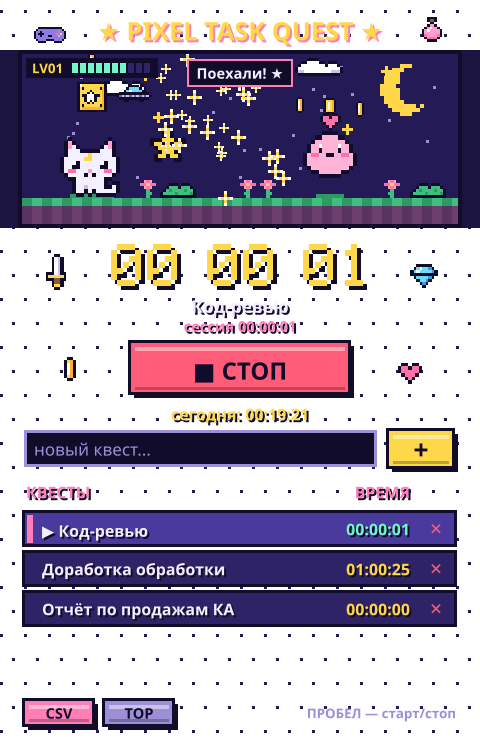

<p align="center">
  
</p>

<h1 align="center">★ Task Quest ★</h1>

<p align="center">Ретро-трекер времени для задач на macOS с переключаемыми скинами.<br>
Нажимаешь «СТАРТ», работаешь, а пиксельные друзья тебя подбадривают.</p>

<p align="center">
  
  &nbsp;
  
</p>

## Возможности

- **Старт / стоп** одной кнопкой или **пробелом**
- **Список задач («квестов»)**: добавить, выбрать, удалить, очистить весь список (с резервной копией). Клик по другой задаче во время работы переключает таймер на неё
- **Время по каждой задаче** и **общее время за день**
- **Уровни**: каждые 25 минут работы за день дают новый LV и «LEVEL UP!»
- **Экспорт в CSV** (открывается в Excel) со всеми сессиями и итогами
- **Режим «поверх окон»**
- **Два скина** переключаются кнопкой **SKIN** на лету. Таймер, квесты и история при этом сохраняются, а выбранный скин запоминается
- Если закрыть окно при идущем таймере, время продолжит считаться до следующего запуска
- Данные сразу сохраняются в `tracker_data.json` рядом со скриптом

## Скины

### ★ Pixel

Ночная пиксельная сцена. Пока таймер стоит, кошечка Мяу-Луна спит. Когда он идёт, все оживают: кошечка прыгает, Моти скачет и пускает сердечки, Звёздочка-фея летает и сыплет искорками. На фоне падает «цифровой дождь» из символов, как в «Матрице» (кнопка RAIN его выключает). На сцене есть облака, НЛО, падающие звёзды, блок-сюрприз с монетками, цветы и пиксельные стикеры вокруг. Плашка «ЗА ДЕНЬ» показывает общее время за сегодня.

### ✦ 2000

Неоновый RPG-интерфейс, окошки в духе Windows 98 и уютная ретро-комната.

- **Комната**: призрак на диване играет в приставку, пока идёт таймер, и спит, когда таймер стоит. На ЭЛТ-телевизоре при работе идёт время сессии, без неё — помехи и «NO SIGNAL». В окне плывут облака, над кружкой поднимается пар
- **HP** — прогресс текущей сессии к 25-минутному фокус-блоку, **MP** — прогресс дня к цели в 8 часов, **TODAY** — общее время за день
- **TIMER.EXE** — главный таймер выбранного квеста, во время работы мигает **REC**
- **Инвентарь**: 💾 CSV, 📌 поверх окон, 🫧 пузыри и рыбки-клоуны (FX), 💣 очистить список, 🎨 сменить скин
- **LV-панель** с портретом призрака: уровень и минуты до следующего
- После 10 минут простоя всплывает окошко **«HELLO!! ARE YOU HERE??»** с кнопкой «MAYBE...»

Все персонажи и спрайты оригинальные и нарисованы прямо в коде строками пикселей.

## Запуск

Нужен только Python 3 с tkinter, сторонние библиотеки не требуются.

```bash
python3 task_quest.py
```

Можно и двойным кликом по `Запустить Task Quest.command`. Чтобы сразу открыть нужный скин, добавь `pixel` или `2000` к команде: `python3 task_quest.py 2000`.

### Приложение для macOS с иконкой

```bash
python3 build_app.py
```

Рядом появится `Task Quest.app`. Его можно перетащить в «Программы» или в Dock. Приложение запускает `task_quest.py` из этой папки, поэтому после переноса папки его нужно пересобрать.

## Управление

| Действие | Как |
|---|---|
| Старт / стоп | кнопка или `Пробел` |
| Добавить задачу | ввести название и нажать `Enter` или `+` / `ADD` |
| Выбрать задачу | клик по строке |
| Удалить задачу | `✕` |
| Сменить скин | `SKIN` |
| Прокрутка списка | колесо мыши |

## Файлы

| Файл | Что внутри |
|---|---|
| `task_quest.py` | приложение: окно, переключение скинов, общая иконка |
| `pixel_tracker.py` | логика трекера и скин Pixel |
| `task_quest_2000.py` | скин 2000 |
| `build_app.py` | сборка `Task Quest.app` |
